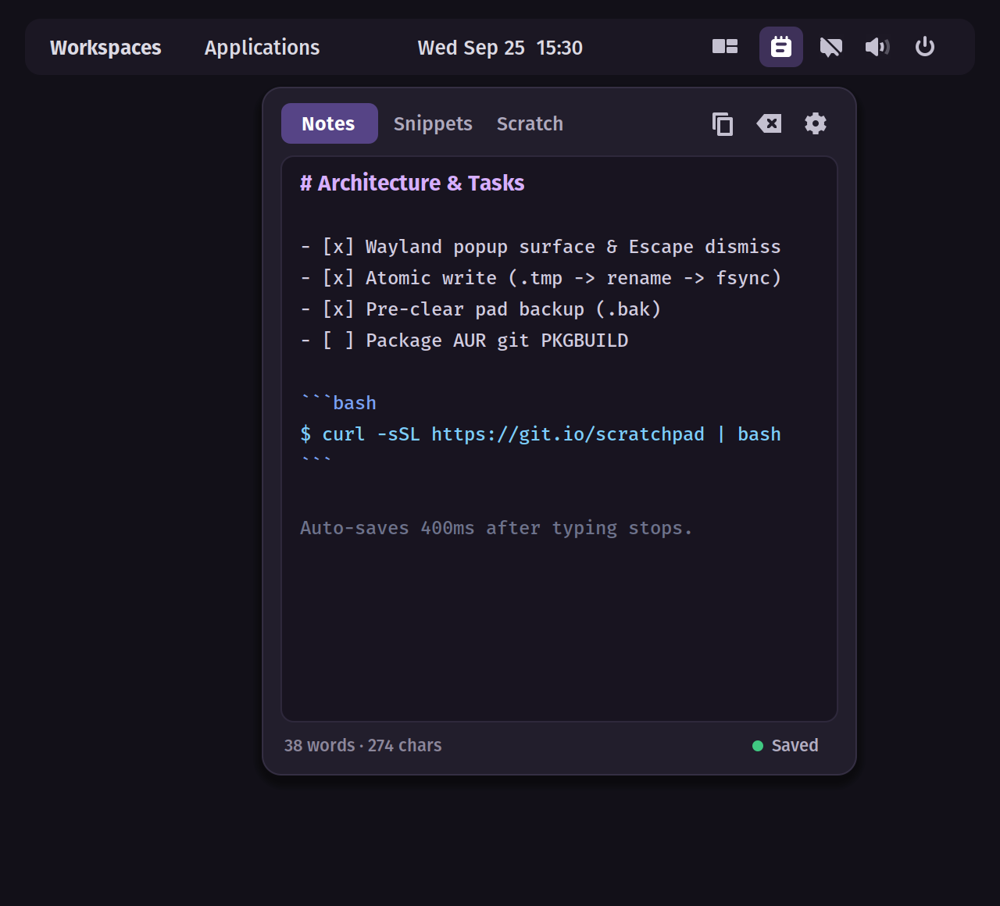

# cosmic-ext-applet-scratchpad

Minimalist quick notes and scratchpad applet for the COSMIC Desktop environment.

Provides immediate access to three separate scratchpads directly from the COSMIC panel.



## Features

- **Multi-Tab Workspace:** Three distinct pads (Notes, Snippets, Scratch) for temporary thoughts, shell commands, or draft text.
- **Crash-Resilient Atomic Storage:** Notes are stored as plain Markdown files (`pad_1.md`, `pad_2.md`, `pad_3.md`) under `$XDG_DATA_HOME/cosmic-scratchpad/`. All writes write to a PID-tagged temporary file first, fsync, and atomic rename.
- **Debounced Auto-Save:** Content saves automatically 400ms after typing stops, or immediately when closing the applet popup or switching tabs.
- **One-Click Copy:** Copies current tab text to the system clipboard with transient visual confirmation.
- **Non-Destructive Clear:** Clearing a note displays a 5-second inline banner allowing immediate undo.
- **Word & Character Counter:** Real-time statistics displayed in the footer.
- **Native COSMIC Integration:** Uses `libcosmic` widgets, adaptive system theming, and `cosmic-config` (RON format).

## Storage & Configuration

- **Note Data:** `~/.local/share/cosmic-scratchpad/pad_{1,2,3}.md`
- **Configuration:** `~/.config/cosmic/io.github.hasmolam.cosmic-ext-applet-scratchpad/v1/config.ron`

## Installation

### Method 1: Single-Line Quick Install

Downloads the latest prebuilt release binary, installs desktop entry and icons, and reloads the panel:

```bash
curl -fsSL https://raw.githubusercontent.com/Hasmolam/cosmic-ext-applet-scratchpad/main/install.sh | bash
```

### Method 2: Arch Linux (PKGBUILD)

```bash
git clone https://github.com/Hasmolam/cosmic-ext-applet-scratchpad.git
cd cosmic-ext-applet-scratchpad/packaging/arch
makepkg -si
```

### Method 3: Build from Source

#### Build Dependencies (Ubuntu/Pop!_OS)

```bash
sudo apt-get update
sudo apt-get install -y cmake libexpat1-dev libfontconfig-dev libfreetype-dev libxkbcommon-dev libwayland-dev pkg-config just
```

#### Compiling and Installing

```bash
git clone https://github.com/Hasmolam/cosmic-ext-applet-scratchpad.git
cd cosmic-ext-applet-scratchpad

# Build and install locally
just build
./install.sh
```

After installation, add the applet to your panel via:
`COSMIC Settings -> Panel -> Applets -> Add -> Scratchpad`.

## Uninstallation

To remove the binary, desktop entry, and icon:

```bash
./uninstall.sh
```

*(Note: User notes in `~/.local/share/cosmic-scratchpad/` are kept intact to avoid data loss).*

## Development

```bash
# Check formatting, lints, and unit tests
just check

# Run directly
just run
```

## License

GPL-3.0-only
